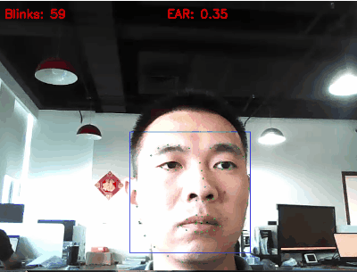

# 眨眼检测c#(.net3.1) 
* 利用 [眼睛纵横比（EAR）](http://vision.fe.uni-lj.si/cvww2016/proceedings/papers/05.pdf?spm=a2c6h.12873639.article-detail.9.7cba3329OtWn6S&file=05.pdf)来进行眨眼算法
* 使用 [dlib](https://github.com/davisking/dlib) 进行人脸以及68特征点检测
* 使用效果

	
* [下载发布版本](https://github.com/laolaolulu/faceAction/releases)